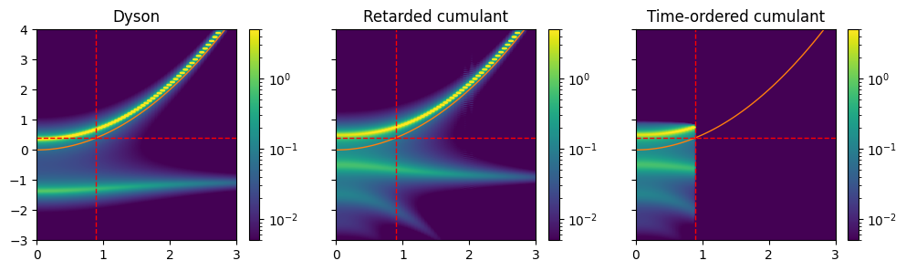
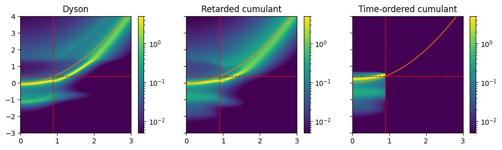

# Cumulant

### Theory
For the formal background of the implementation, please take a look at the [note (pdf)](note/main.pdf)

### Installing the dependencies
```bash
julia -e --project=. "using Pkg; Pkg.instantiate(); Pkg.precompile()"
```

### Running the script
```bash
julia -t 8 --project=. main.jl
```

Modify `-t 8` to use different number of threads than 8.


### Model Lorentzian self-energy


### Frohlich model

